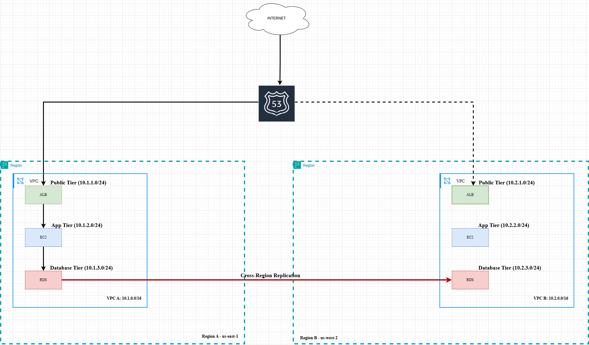

# 🌍 Global E-Commerce Resilient Infrastructure (AWS + Terraform)

## 📌 Project Overview

This project demonstrates how to build a **highly available, multi-region e-commerce backend infrastructure** using **AWS and Terraform**.

The goal is to design a cloud architecture that remains available even if one AWS region fails.

The infrastructure includes:

- Custom VPC networking
- Auto Scaling EC2 instances
- Application Load Balancer
- Multi-region deployment
- Disaster recovery with Route53
- Infrastructure as Code using Terraform

---

# 🚨 Problem Statement

Modern web applications must be highly available and fault tolerant.

However, many systems face the following problems:

1. Single region deployment causing downtime during regional outages.
2. Traffic spikes causing server crashes.
3. Lack of automatic failover between regions.
4. Manual infrastructure configuration leading to errors.

This project solves these problems by implementing **a resilient cloud architecture**.

---

# 🏗️ Architecture Design

The infrastructure is deployed across **two AWS regions**:

### Primary Region

us-east-1

Components:
- VPC
- Public Subnets
- Application Load Balancer
- Auto Scaling Group
- EC2 Web Servers

### Secondary Region

us-west-2

Components:
- VPC
- Public Subnets
- Application Load Balancer
- Auto Scaling Group
- EC2 Web Servers

---

# 🌐 High Availability Strategy

Traffic flow:

Route53
│
│
Primary Region (us-east-1)
ALB → Auto Scaling → EC2

If primary fails

Secondary Region (us-west-2)
ALB → Auto Scaling → EC2

Route53 performs **DNS failover routing** to redirect traffic when the primary region becomes unhealthy.

---

# 📊 Phase 1 – VPC Architecture

The first phase creates the networking layer including:

- Custom VPC
- Public Subnets
- Private Subnets
- Internet Gateway
- Route Tables

---

# ⚙️ Phase 2 – Compute Layer

This phase deploys EC2 instances that run the backend service.

Features:

- Amazon Linux EC2
- Apache Web Server
- User-data script to configure the server
- Security groups allowing HTTP and SSH

---

# ⚖️ Phase 3 – Load Balancing & Auto Scaling

To handle traffic spikes, we implemented:

- Application Load Balancer
- Auto Scaling Group
- Launch Templates
- Health checks

Benefits:

- Automatic scaling
- Load distribution
- Improved reliability

---

# 🌎 Phase 4 – Multi-Region Deployment

Infrastructure is deployed in **two AWS regions**:

Primary Region

us-east-1

Secondary Region

us-west-2

This ensures the application remains available even during regional outages.

---

# 🔁 Phase 5 – Disaster Recovery (Route53)

Amazon Route53 is used for **DNS failover routing**.

If the primary region becomes unhealthy:

Traffic automatically redirects to the secondary region.

This enables **disaster recovery for the application**.

---

# 🧰 Technologies Used

- AWS
- Terraform
- EC2
- VPC
- Application Load Balancer
- Auto Scaling
- Route53
- Git
- GitHub

---

# 📁 Project Structure

global-ecommerce-resilience
│
├── diagrams
│ └── phase-1-vpc-architecture.png
│
├── scripts
│
├── terraform
│ ├── modules
│ ├── region-primary
│ └── region-secondary
│
├── .gitignore
└── README.md

---

# 🚀 Learning Outcomes

From this project we learned:

- Infrastructure as Code using Terraform
- AWS networking architecture
- Load balancing and scaling
- Multi-region infrastructure design
- Disaster recovery strategies
- GitHub project documentation

---

# 🎯 Future Improvements

Possible improvements:

- Add AWS CloudFront CDN
- Add AWS WAF for security
- Use RDS for database layer
- Implement CI/CD pipelines
- Monitoring using CloudWatch

---

